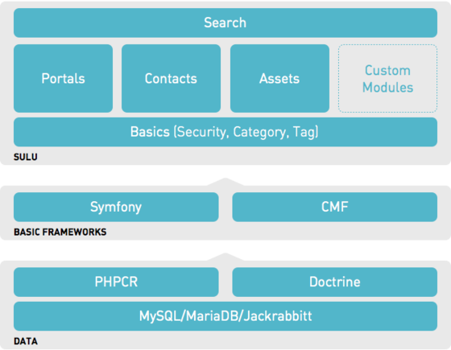

# Sulu Minimal Edition

Welcome to the Sulu Minimal Edition - a fully-functional Sulu application that you can use as the skeleton for your new
applications.

## Installation

**Warning** Sulu will not work on a Linux encrypted filesystem use `ecryptfs-verify -h` on to check your installation folder

- Start docker containers

```bash
make infra-up
```
- Install the dependencies and initialize the database

```bash
make app-install
```

* Site: [http://localhost:8000](http://localhost:8000)
* Admin : [http://localhost:8000/admin](http://localhost:8000) (login: admin/admin)


## Structure



